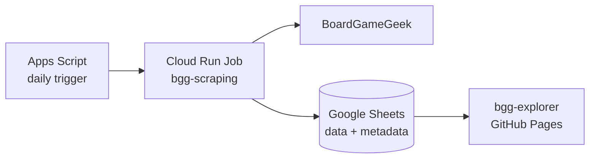

# BGG scraping

This project refreshes the board-game data consumed by
[bgg-explorer](https://github.com/watabean/bgg-explorer).

## Architecture



Apps Script calls the Cloud Run Jobs API and returns as soon as the execution has started. The job performs the
long-running scrape, validates the complete result, and then replaces the `data` sheet. A partial scrape therefore
does not destroy the last successful dataset.

The `metadata` sheet records `lastUpdatedAt`, `itemCount`, `source`, and `schemaVersion` after each successful refresh.

## Local setup

Install the Volta-managed Node.js and npm versions, then install dependencies:

```bash
npm install
```

Run the existing local CSV export:

```bash
npm start
```

To refresh Google Sheets locally, configure Application Default Credentials and the environment variables below,
then run:

```bash
npm run refresh-sheet
```

Build, test, and lint:

```bash
npm run build
npm test
npm run lint
```

## Cloud Run Job configuration

The deployed job runs `dist/job.js` using a single task. Its runtime service account must have editor access to the
target spreadsheet.

| Environment variable  | Default    | Purpose                                                |
| --------------------- | ---------- | ------------------------------------------------------ |
| `SPREADSHEET_ID`      | required   | Target spreadsheet ID                                  |
| `DATA_SHEET_NAME`     | `data`     | Dataset consumed by bgg-explorer                       |
| `METADATA_SHEET_NAME` | `metadata` | Refresh metadata                                       |
| `MIN_ITEM_COUNT`      | `450`      | Prevents partial data from replacing the current sheet |

Deployment is handled by `.github/workflows/main.yml`. The workflow deploys a Cloud Run Job with a 30-minute task
timeout and one retry.

See [gas/README.md](gas/README.md) for the one-time Google Cloud and Apps Script setup.
